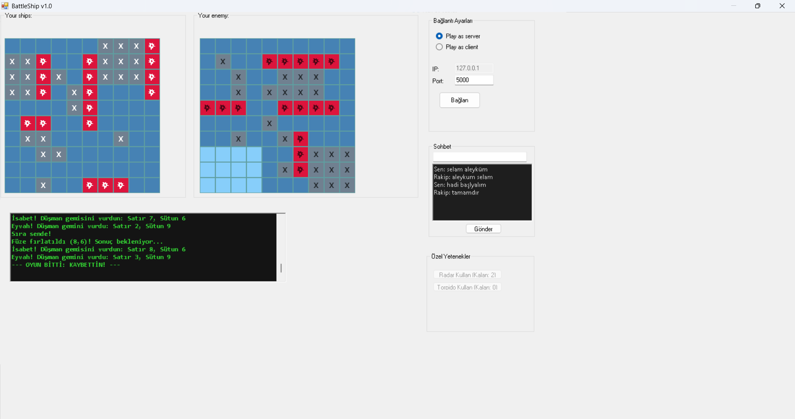
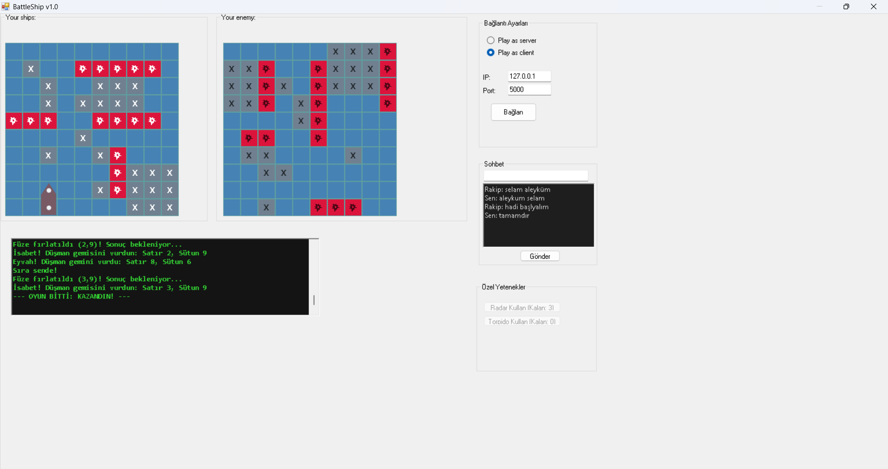

<div align="center">

# ⚓ BATTLESHIP MULTIPLAYER

**C# • WinForms • TCP/IP Sockets • GDI+**

[](#)
[](#)
[](#)
[](#)

*Geleneksel şansa dayalı Amiral Battı oyununu; akıllı avcı algoritmalar, taktiksel yetenekler ve yerel ağ (LAN) üzerinden gecikmesiz çok oyunculu deneyim ile yeniden tasarladık.*

<br>

<p align="center">
  <a href="#-hakkında">Hakkında</a> •
  <a href="#-öne-çıkan-özellikler">Özellikler</a> •
  <a href="#-oyun-mekanikleri">Mekanikler</a> •
  <a href="#-mimari-ve-teknik-detaylar">Teknik Detaylar</a> •
  <a href="#-kurulum">Kurulum</a> 
</p>

</div>

---

## 📸 Oyun İçi Görseller

<div align="center">
  <table>
    <tr>
      <td width="50%" align="center">
        <b>Savaş Ekranı ve Radar Yeteneği</b><br>
        
      </td>
      <td width="50%" align="center">
        <b>Gerçek Zamanlı Sohbet ve Sonuç</b><br>
        
      </td>
    </tr>
  </table>
</div>

<br>

## 🚀 Hakkında

Bu proje, bir masaüstü uygulamasının ötesine geçerek **ağ programlama (Network Programming)** ve **algoritmik düşünce** yeteneklerini bir araya getiren kapsamlı bir simülasyondur. İster gelişmiş yapay zekaya karşı çevrimdışı (offline) antrenman yapın, isterseniz `TcpListener` ve `TcpClient` mimarisiyle kurulan sunucuda arkadaşlarınızla amansız bir deniz savaşına tutuşun.

## ✨ Öne Çıkan Özellikler

> **🤖 Hedef Odaklı Avcı Yapay Zeka (AI)**
> Sadece rastgele atışlar yapan klasik botların aksine, ilk isabeti aldığında bir *Target Queuing (Hedef Kuyruğu)* sistemi başlatır. Geminin doğrultusunu hesaplar ve etrafını acımasızca tarayarak gemiyi tamamen batırana kadar peşini bırakmaz.

> **🌐 Gecikmesiz TCP/IP Multiplayer**
> Sunucu (Server) ve İstemci (Client) mantığıyla çalışır. Ağ dinleme işlemleri, oyun arayüzünü (UI) dondurmaması için arka plan iş parçacıklarında (Multithreading/Task) asenkron olarak yürütülür.

> **🎨 Dinamik GDI+ Arayüz (Responsive)**
> Form boyutundan veya Windows ölçeklemesinden etkilenmemesi için gemiler sabit resimlerle değil; çalışma zamanında (Runtime) piksel bazlı çizilen ve köşeleri hesaplanan dinamik panellerle oluşturulur.

<br>

## ⚡ Oyun Mekanikleri

Standart füzelerin yanı sıra, oyunculara savaşın gidişatını değiştirecek **Özel Taktiksel Yetenekler** sunulmuştur:

| Yetenek | Açıklama | Limit |
| :---: | :--- | :---: |
| 📡 **Radar** | Düşman haritasında seçilen 4x4'lük bölgeyi tarar. O alanda saklanan gemi parçası sayısını istihbarat olarak raporlar. | 3 Adet |
| 🚀 **Torpido** | Düşman sularında seçilen 3x3'lük (9 kare) geniş bir alana ağır bombardıman yapar. Toplu hasar için idealdir. | 2 Adet |
| 💬 **Sohbet** | Multiplayer modunda rakiplerin birbiriyle eşzamanlı mesajlaşmasını sağlayan entegre iletişim modülü. | Sınırsız |

<br>

## 🛠 Mimari ve Teknik Detaylar

Proje kodlanırken **SOLID** prensiplerine ve modüler mimariye dikkat edilmiştir.
- **Dil & Platform:** `C#` / `.NET Framework 4.7.2`
- **Ağ İletişimi:** `System.Net.Sockets` adayı (Veri akışı `StreamReader` ve `StreamWriter` ile bayt kaybı olmadan sağlanır).
- **Asenkron Yapı:** `Task.Run` ve Form `MethodInvoker` delegeleri sayesinde Cross-Thread (Çapraz İş Parçacığı) çakışmaları önlenmiştir.
- **Harita Matrisi:** Oyun tahtası arkaplanda enum tabanlı 2 Boyutlu (2D) dizilerle ( `CellState[,]` ) O(1) karmaşıklığında yönetilir.

<br>

## 🚀 Kurulum ve Oynanış

Projeyi kendi bilgisayarınızda çalıştırmak için aşağıdaki adımları izleyebilirsiniz:

1. Depoyu yerel makinenize klonlayın:
   ```bash
   git clone [https://github.com/harunaydemir/Battleship-Multiplayer.git](https://github.com/harunaydemir/Battleship-Multiplayer.git)

